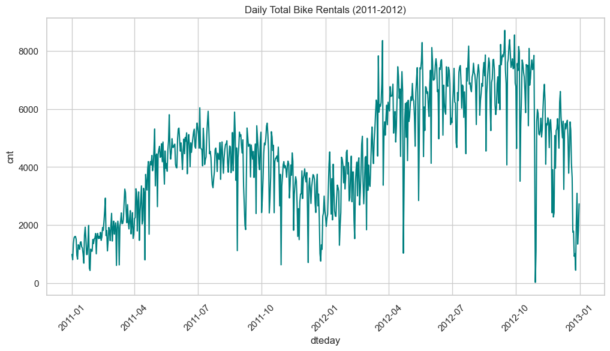
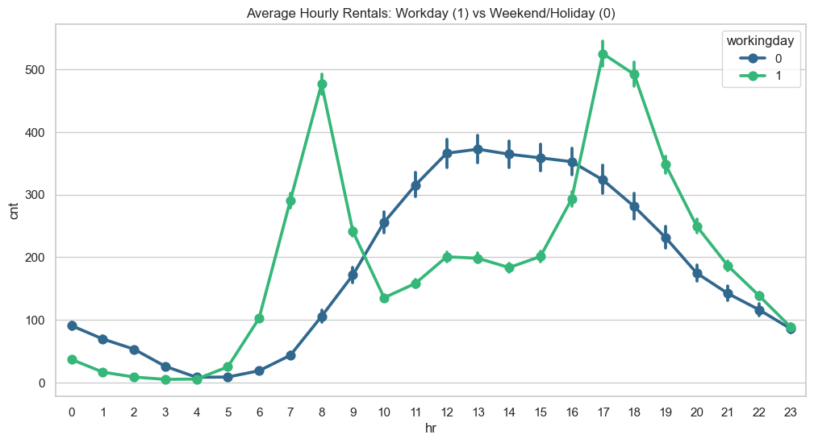
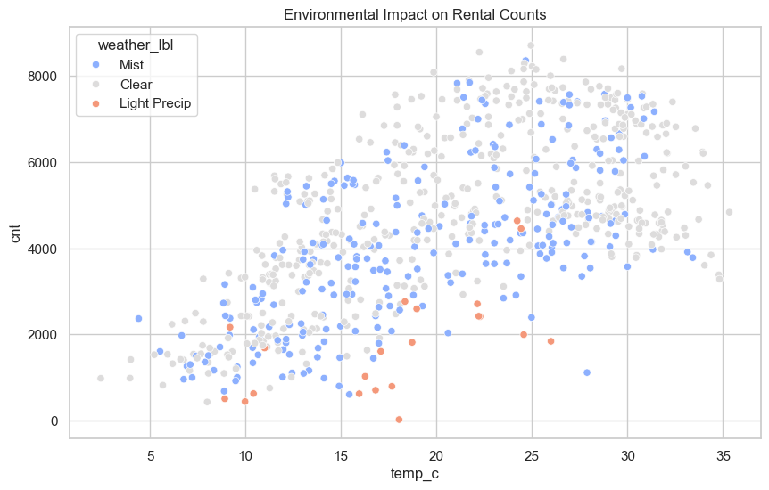
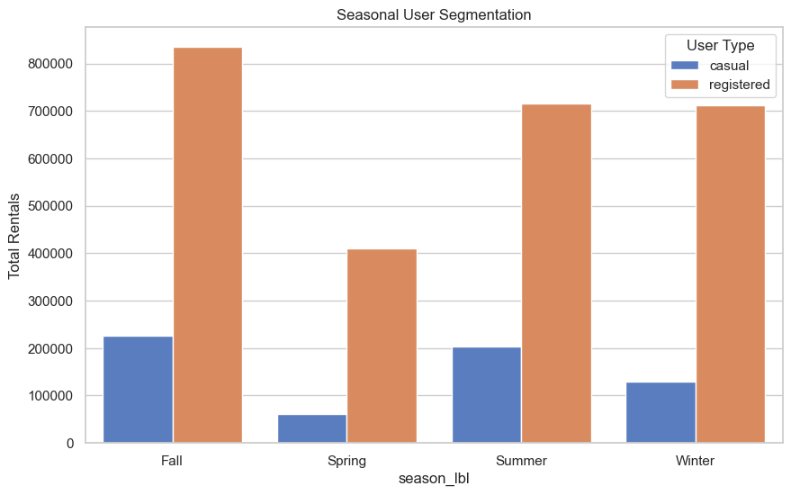
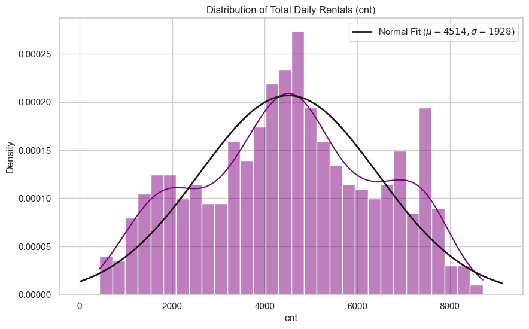
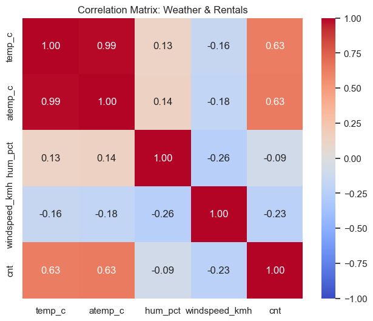
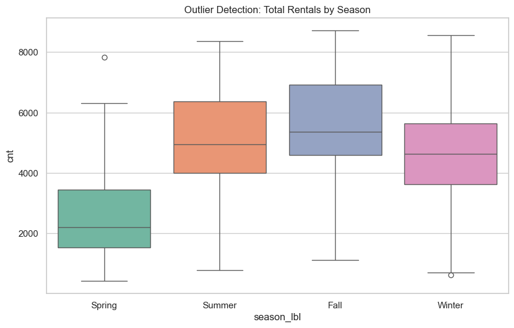

# 🚲 Bike Sharing Usage Behavior Analysis

> **Analyzing bike-sharing rental patterns to optimize urban mobility through data-driven insights.**

---

## Project Overview

This project analyzes bike-sharing usage patterns from Washington D.C.'s Capital Bikeshare system (2011–2012) to understand how temporal factors (hour, day, season) and environmental conditions (temperature, humidity, weather) affect rental behavior across different user segments (casual vs. registered).

### Objectives
- Understand hourly, daily, and seasonal rental trends
- Quantify weather impact on bike-sharing demand
- Compare casual vs. registered user behavior patterns
- Deliver actionable insights for operational optimization

---

## Stakeholders

| Role | Responsibility |
|------|---------------|
| **City Mobility Team** | Strategic planning, infrastructure decisions |
| **Operations Team** | Bike redistribution, maintenance scheduling, staffing |
| **Researchers** | Lavanya Yadawad, Om S Habib |

---

## Problem Statement

Bike-sharing systems generate massive amounts of data, but the challenge lies in extracting actionable insights regarding the impact of environmental (weather) and temporal (time/season) factors on different user segments. This project provides data-driven insights to optimize bike availability and operational efficiency.

---

## Analytical Questions

1. How do hourly and daily rental patterns change across the dataset?
2. To what extent do weather conditions (temperature, humidity, wind speed) impact total rentals?
3. How does casual user behavior compare to registered subscribers (peak hours, seasonal variance)?
4. What are the peak usage hours, and how do they shift between weekdays and weekends?
5. Are there identifiable seasonal trends or demand spikes?

---

## Tech Stack

| Category | Tools |
|----------|-------|
| **Analysis** | Python (Pandas, NumPy, Matplotlib, Seaborn, SciPy) |
| **Notebooks** | Jupyter Notebook |
| **Dashboard** | Power BI / Tableau |
| **Version Control** | Git + GitHub |

---

## Project Structure

```
Bike-Sharing-Usage-Behavior/
├── Dataset/
│   ├── day.csv                      # Daily aggregated bike rentals (731 records)
│   ├── hour.csv                     # Hourly aggregated bike rentals (17,379 records)
│   └── Readme.txt                   # Original UCI dataset description
├── Diagrams/
│   ├── Consumer Flow Diagram.png    # Stakeholder-to-optimization flow
│   ├── Data Flow Diagram.png        # Data pipeline visualization
│   ├── HLD - HIgh level Diagram.png # High-level architecture
│   └── LLD - Final.png             # Low-level module design
└── README.md                       # This file
```

---

## Dataset

- **Source**: [UCI Machine Learning Repository — Bike Sharing Dataset](https://archive.ics.uci.edu/ml/datasets/Bike+Sharing+Dataset)
- **Original Author**: Hadi Fanaee-T, LIAAD / INESC Porto, University of Porto
- **System**: Capital Bikeshare, Washington D.C., USA
- **Period**: January 2011 – December 2012

| File | Granularity | Records | Columns | Size |
|------|-------------|---------|---------|------|
| `day.csv` | Daily | 731 rows | 16 | ~57 KB |
| `hour.csv` | Hourly | 17,379 rows | 17 (includes `hr`) | ~1.1 MB |

---

## Data Dictionary

### Identifiers & Date
| Variable | Type | Description |
|----------|------|-------------|
| `instant` | Integer | Record index (auto-increment) |
| `dteday` | Date | Date of observation (YYYY-MM-DD) |

### Temporal Features
| Variable | Type | Values | Description |
|----------|------|--------|-------------|
| `season` | Categorical | 1=Spring, 2=Summer, 3=Fall, 4=Winter | Season of the year |
| `yr` | Binary | 0=2011, 1=2012 | Year |
| `mnth` | Integer | 1–12 | Month |
| `hr`* | Integer | 0–23 | Hour of the day (**hour.csv only**) |
| `holiday` | Binary | 0/1 | Whether it is a public holiday |
| `weekday` | Integer | 0–6 | Day of the week (0=Sunday) |
| `workingday` | Binary | 0/1 | 1 if neither weekend nor holiday |

### Weather Features (Normalized)
| Variable | Type | Range | Description |
|----------|------|-------|-------------|
| `weathersit` | Categorical | 1–4 | Weather situation (see codes below) |
| `temp` | Float | 0–1 | Normalized temperature (actual / 41°C) |
| `atemp` | Float | 0–1 | Normalized feeling temperature (actual / 50°C) |
| `hum` | Float | 0–1 | Normalized humidity (actual / 100%) |
| `windspeed` | Float | 0–1 | Normalized wind speed (actual / 67 km/h) |

### Target Variables
| Variable | Type | Description |
|----------|------|-------------|
| `casual` | Integer | Count of casual (walk-up) users |
| `registered` | Integer | Count of registered subscribers |
| `cnt` | Integer | Total rental count (`casual + registered`) |

### Weather Situation Codes

| Code | Category | Description |
|------|----------|-------------|
| 1 | **Clear** | Clear, Few clouds, Partly cloudy |
| 2 | **Mist** | Mist + Cloudy, Mist + Broken clouds |
| 3 | **Light Precip** | Light Snow, Light Rain + Thunderstorm |
| 4 | **Heavy Precip** | Heavy Rain + Ice Pallets + Snow + Fog |

### De-normalization Formulas

| Field | Formula | Unit |
|-------|---------|------|
| `temp` | value × 41 | °C |
| `atemp` | value × 50 | °C |
| `hum` | value × 100 | % |
| `windspeed` | value × 67 | km/h |

---

## Dataset Understanding

### Key Observations

- **Growth Year-over-Year**: 2012 rentals are substantially higher than 2011 across all months
- **Strong Seasonality**: Fall & Summer show highest usage; Spring is lowest
- **Registered Dominance**: Registered users account for ~81% of all rides; casual ~19%
- **Weather Sensitivity**: `weathersit=4` (heavy rain/snow) virtually kills demand (e.g., Oct 29, 2012: cnt=22)
- **Holiday Dip**: Rental counts generally dip on holidays, especially for registered commuters
- **Temperature Correlation**: Strong positive correlation between `temp`/`atemp` and `cnt`
- **Humidity Inverse**: Higher humidity generally correlates with lower ridership

### Weekday vs Weekend Patterns
- **Weekdays** (workingday=1): Dominated by registered users (commute pattern)
- **Weekends** (workingday=0): Casual user share increases significantly (leisure pattern)

### Hourly Patterns (hour.csv)
- **Morning Rush**: 7–9 AM (registered-heavy, commute)
- **Evening Rush**: 5–7 PM (registered-heavy, commute)
- **Midday on Weekends**: 10 AM–4 PM (casual-heavy, recreation)
- **Bimodal commute peaks** on workdays; **unimodal wide midday peak** on weekends
- `hr=17` (5 PM) consistently has the highest average `cnt`

### Numerical Summary (day.csv)

| Statistic | temp | atemp | hum | windspeed | casual | registered | cnt |
|-----------|------|-------|-----|-----------|--------|------------|-----|
| Min | 0.059 | 0.079 | 0.0 | 0.022 | 2 | 20 | 22 |
| Max | 0.862 | 0.841 | 0.973 | 0.507 | 3,410 | 6,946 | 8,714 |
| Mean | ~0.496 | ~0.474 | ~0.628 | ~0.190 | ~848 | ~3,656 | ~4,504 |

---

## Known Caveats & Data Quality

### Null & Missing Values
- **No null values** in either CSV
- Some hours (typically 3–5 AM) are absent from `hour.csv` — likely had zero rentals and were dropped

### Outliers & Anomalies

| Record | Date | Issue | Likely Cause |
|--------|------|-------|--------------|
| day.csv row 668 | 2012-10-29 | `cnt = 22` | **Hurricane Sandy** |
| day.csv row 669 | 2012-10-30 | `cnt = 1096` | Post-hurricane recovery |
| day.csv row 70 | 2011-03-10 | `hum = 0.0` | Sensor error |

### Encoding Notes
- Season `1` labeled "springer" (sic) in original — means **Spring**
- Weekday `0` = Sunday (differs from Python's `datetime.weekday()` where 0 = Monday)
- `weathersit = 4` rare in hourly, effectively absent from daily aggregation
- Year `0/1` instead of `2011/2012` — needs mapping

### Temporal Notes
- DST transitions not explicitly handled
- Feb 29, 2012 included (leap year)
- 2012 has systematically higher counts (system growth), which should be accounted for in models

### Data Integrity ✅
- `cnt == casual + registered` — 100% pass on all rows
- Unique `instant` values — no duplicates
- 731 consecutive days — no gaps
- Column count matches documentation (day=16, hour=17)

---

## KPI Definitions

### Category 1: Peak Usage Detection

| KPI | Definition | Formula |
|-----|-----------|---------|
| **Peak Hour Index** | Top-3 busiest hours per day type | `argmax(avg_cnt by hr)` grouped by `workingday` |
| **Daily Peak Count** | Max daily rental count per month | `max(cnt) group by mnth, yr` |
| **Rush-Hour Concentration** | % of daily rentals during peak hours (7–9 AM, 5–7 PM) | `sum(cnt_peak) / sum(cnt)` × 100 |

### Category 2: Weather Sensitivity Metrics

| KPI | Definition | Formula |
|-----|-----------|---------|
| **Weather-Rental Correlation** | Pearson correlation temp ↔ cnt | `corr(temp, cnt)` |
| **Bad-Weather Drop %** | Rental drop in weathersit≥3 vs 1 | `(avg_clear - avg_bad) / avg_clear` × 100 |
| **Temperature Threshold** | Temp below which avg daily cnt < 2,000 | Conditional mean analysis |
| **Humidity Impact Score** | Regression coefficient of hum on cnt | Partial correlation / OLS β |

### Category 3: User Growth & Retention

| KPI | Definition | Formula |
|-----|-----------|---------|
| **YoY Growth Rate** | Year-over-year growth in total rentals | `(total_2012 - total_2011) / total_2011` × 100 |
| **Casual-to-Registered Ratio** | Monthly casual/registered ratio | `sum(casual) / sum(registered)` |
| **Weekend Casual Share** | % of weekend rentals that are casual | `sum(casual_wknd) / sum(cnt_wknd)` × 100 |
| **Seasonal Registered Growth** | Registered user growth per season YoY | Compare seasonal totals |

### Category 4: Decision-Support Metrics

| KPI | Definition | Formula |
|-----|-----------|---------|
| **Predicted Demand** | Estimated daily demand from weather | Regression model output |
| **Redistribution Trigger** | Hours exceeding capacity threshold | `predicted_cnt > threshold` |
| **Maintenance Window** | Optimal low-demand hours | Hours with `avg_cnt < P10` |
| **Pricing Signal** | Demand elasticity by user type | `casual_peak / casual_offpeak` |

### Measurement Schedule

| Frequency | KPIs |
|-----------|------|
| **Daily** | Peak Hour Index, Daily Peak Count |
| **Weekly** | Rush-Hour Concentration, Weekend Casual Share |
| **Monthly** | Weather-Rental Correlation, Casual-to-Registered Ratio |
| **Quarterly** | Seasonal Registered Growth, YoY Growth Rate |
| **Ad-hoc** | Predicted Demand, Redistribution Trigger, Maintenance Window |

---

## Dashboard Wireframe

### Layout Overview

```
┌──────────────────────────────────────────────────────────────────┐
│  🚲 BIKE SHARING ANALYTICS DASHBOARD        [Date Range Filter] │
│                                              [Season Filter    ] │
│                                              [User Type Filter ] │
├──────────────┬─────────────┬─────────────────┬───────────────────┤
│ TOTAL RIDES  │ AVG DAILY   │ CASUAL SHARE    │ YOY GROWTH       │
│ (KPI Card)   │ (KPI Card)  │ (KPI Card)      │ (KPI Card)       │
└──────────────┴─────────────┴─────────────────┴───────────────────┘
```

### Page 1: Usage Trends

| Component | Chart Type | Axes |
|-----------|-----------|------|
| Daily Rental Trend | Line chart | X: date, Y: cnt (split casual/registered) |
| Hourly Usage Heatmap | Heatmap | X: hr (0–23), Y: weekday |
| Monthly Avg Comparison | Grouped bar | X: month, Y: avg(cnt), Groups: 2011 vs 2012 |
| Peak Hours | Horizontal bar | X: avg(cnt), Y: hr, Split: weekday vs weekend |

### Page 2: Weather Impact

| Component | Chart Type | Axes |
|-----------|-----------|------|
| Temperature vs Rentals | Scatter | X: temp, Y: cnt, Color: weathersit |
| Humidity vs Rentals | Scatter | X: hum, Y: cnt, Overlay: trend line |
| Weather Breakdown | Stacked bar | X: weathersit, Y: avg(cnt), Split: casual/registered |
| Wind Speed Impact | Box plot | X: windspeed quartile, Y: cnt |

### Page 3: User Segmentation

| Component | Chart Type | Axes |
|-----------|-----------|------|
| Casual vs Registered | Dual line | X: month, Y: sum, Split: user type |
| Day-Type Split | 100% stacked bar | X: weekday, Y: share %, Split: user type |
| Seasonal Distribution | Donut × 4 | Per season: casual vs registered share |
| Holiday Comparison | Bar | X: holiday status, Y: avg(cnt) |

### Page 4: Distribution Insights

| Component | Chart Type | Axes |
|-----------|-----------|------|
| Rental Distribution | Histogram | X: cnt bins, Y: frequency, Overlay: normal curve |
| Stats Table | Table | Skewness, Kurtosis, Std per season |
| Outlier Detection | Box plot | X: season, Y: cnt with IQR |
| Correlation Matrix | Heatmap | temp, atemp, hum, windspeed, cnt |

### Interactivity
- Global Date Range Slicer
- Season Slicer (multi-select)
- User Type Toggle (casual / registered / both)
- Cross-page drill-through
- Tooltip-on-hover with exact values

---

## Cleaning Strategy Plan (Week 3)

### 1. Handling Missing Hourly Records
- `hour.csv` contains gaps (e.g., 3–5 AM). 
- **Action**: Use a `RangeIndex` or `Reindexing` strategy to ensure a continuous 24-hour timeline per day. Fill missing counts with `0`.

### 2. Anomalous Record Management
- **Action**: Create a `is_anomaly` flag for the Hurricane Sandy period (Oct 29–31, 2012).
- **Rationale**: Keeps the data for completeness but allows filtering for trend modeling.

### 3. Feature De-normalization
- **Action**: Create new columns `temp_c`, `atemp_c`, `hum_pct`, and `windspeed_kmh` using the UCI formulas.
- **Rationale**: Improves interpretability for EDA and stakeholders.

### 4. Categorical Labeling
- **Action**: Map integer codes to human-readable labels:
  - `season`: 1 → Spring, 2 → Summer, etc.
  - `weathersit`: 1 → Clear, 2 → Mist, etc.
  - `yr`: 0 → 2011, 1 → 2012.

---

## Feature Engineering Blueprint (Week 3)

### 1. Temporal Engineering
- **`day_segment`**: Categorize `hr` into `Night` (0-6), `Morning` (6-12), `Afternoon` (12-18), `Evening` (18-24).
- **`is_peak_hour`**: Boolean flag for commute peaks (7-9 AM, 5-7 PM) on `workingday=1`.
- **`is_weekend`**: Boolean derived from `workingday` and `holiday`.

### 2. Environmental Engineering
- **`temp_category`**: Bin `temp_c` into `Cold` (<10°C), `Mild` (10-20°C), `Warm` (20-30°C), `Hot` (>30°C).
- **`weather_severity`**: Aggregate `weathersit` into `Good` (1), `Moderate` (2), and `Bad` (3, 4).

### 3. User Behavior Metrics
- **`casual_share`**: Percentage of total rentals that are casual users (`casual / cnt * 100`).
- **`registered_share`**: Percentage of total rentals that are registered subscribers (`registered / cnt * 100`).

---

## Week 4: Data Processing & EDA

### 1. Data Quality Report
- **Total Records**: 731 Daily, 17,379 Hourly.
- **Missing Values**: 0 (systmatically checked).
- **Duplicates**: 0.
- **Anomalies**: 3 days identified during Hurricane Sandy (Oct 29–31, 2012) and flagged.
- **Cleaned Datasets**: [`Dataset/cleaned_day.csv`](file:///Users/zenx/Bike-Sharing-Usage-Behavior/Dataset/cleaned_day.csv), [`Dataset/cleaned_hour.csv`](file:///Users/zenx/Bike-Sharing-Usage-Behavior/Dataset/cleaned_hour.csv).

### 2. Baseline EDA & Visualizations

#### A. Daily Rental Trend (2011–2012)
The time-series shows a clear upward trend from 2011 to 2012, indicating rapid system growth, alongside strong seasonal oscillations.



#### B. Hourly Pattern: Workday vs. Non-Workday
Workdays show a distinct bimodal distribution with peaks at 8 AM and 5 PM. Weekends/Holidays show a unimodal distribution with a broad peak from 10 AM to 4 PM.



#### C. Weather Impact: Temperature vs. Count
There is a strong positive correlation between temperature and rental volume. Higher density of rentals occurs in "Clear" and "Mist" weather conditions, with significant drops in "Light Precipitation".



#### D. Seasonal Distribution: User Types
Fall and Summer attract the most riders. Registered users dominate across all seasons, but casual ridership peaks significantly during the Summer and Fall periods.



### 3. Key Findings
- **Commuters** (registered) drive the dual-peak productivity on workdays.
- **Leisure riders** (casual) drive the midday weekend peaks.
- **Seasonality** is the strongest predictor of volume after time-of-day.
- **System Growth** is near 50% year-over-year.

---

### 3. Statistical Analysis Visualizations

#### A. Rental Distribution
The density histogram with a normal curve overlay confirms the daily total rentals (`cnt`) is slightly non-normal, failing the Shapiro-Wilk test.


#### B. Correlation Matrix
The heatmap visualizes Pearson correlations between continuous weather variables and ridership, confirming temperature as the strongest driver.


---

## Week 5: Distribution & Correlation Analysis

### 1. Distribution Fitting
Using the Shapiro-Wilk test, we determined that the total daily rentals (`cnt`), `casual`, and `registered` ridership do not follow a strict normal distribution (all returned $p < 0.05$). The `casual` distribution shows a moderate positive skewness (~1.26), indicating that casual rentals are typically low but experience extreme spikes on optimal leisure days.

### 2. Seasonality Analysis
Bike rentals exhibit massive seasonal variance. Fall and Summer represent the absolute peaks of ridership, while Spring represents the lowest usage.

### 3. Correlation Analysis
Pearson and Spearman correlation tests against environmental variables confirm:
- **Temperature (`temp_c`)**: Strongest positive predictor of bike rentals (0.63 correlation with `cnt`).
- **Wind & Humidity**: Showed statistically significant but weak negative correlations with ridership. Riders are particularly averse to high windspeeds.

#### C. Outlier Detection
Box plots demonstrate the spread and interquartile range (IQR) of total rentals segregated by season, highlighting the differences in medians across seasons.


---

## Week 6: Statistical Validation & Segmentation

### 1. Segmentation by User Type & Time
We segmented user behavior by `workingday` (0 = weekend/holiday, 1 = workday):
- **Casual Users**: Showed a massive spike on non-working days.
- **Registered Users**: Showed a massive spike on working days.

### 2. Quantified Deltas (T-Tests)
Welch's Independent T-Test was utilized to validate the segmentation:
- **Casual Delta**: Rose from average 609 on working days to 1371 on non-working days. The difference is extremely significant ($p \ll 0.05$, $t = -12.68$).
- **Registered Delta**: Stood at 3989 on working days vs. 2959 on non-working days ($p \ll 0.05$, $t = 9.36$).
- **Total Count (`cnt`) Delta**: The two segments counterbalance each other so perfectly that total volume technically experiences no statistically significant difference between working and non-working days ($p = 0.091$).

### 3. ANOVA Validation for Categorical Variables
We utilized One-Way ANOVA to validate whether variance in the total rental count is genuinely dictated by categorical groups:
- **Weather Situation**: Strongly validated ($F = 37.38$, $p = 3.51 \times 10^{-16}$). Demand drops demonstrably from Clear to Light Precip.
- **Seasonality**: Strongly validated ($F = 131.37$, $p = 6.00 \times 10^{-68}$).

---

## Week 7: Insight & Impact Summary

### Top 5 Findings & Hypotheses

#### 1. The "Counterbalancing" Effect of User Types
**Finding:** Total daily bike volume (`cnt`) is statistically identical between workdays and weekends. However, *who* is riding shifts entirely: Registered users commute on workdays, while Casual users swarm on weekends.
**Impact Hypothesis:** Operations can anticipate a steady macro-volume of daily maintenance, but station rebalancing routes must be completely overhauled on Friday evenings to transition from business-district hubs to recreational hubs (parks, monuments).

#### 2. Extreme Weather Sensitivity
**Finding:** Heavy precipitation drops rentals to near-zero (e.g., Hurricane Sandy resulted in just 22 rentals), and even light precipitation causes a statistically significant drop-off.
**Impact Hypothesis:** Real-time weather API integration can perfectly trigger dynamic staffing. On high-rain forecast days, ground staffing for bike repositioning should be minimized to save operational costs.

#### 3. Temperature > Humidity/Wind
**Finding:** Temperature has a 0.63 positive correlation with ridership, making it the single strongest continuous predictor of demand, far outweighing wind or humidity.
**Impact Hypothesis:** Marketing campaigns to convert Casual riders to Registered subscribers will see the highest ROI when launched on the first warm days of early Spring, capturing users when their willingness-to-ride is naturally peaking.

#### 4. Bimodal Workday Demand
**Finding:** Workdays show extremely sharp usage spikes at 8 AM and 5 PM.
**Impact Hypothesis:** If station docks empty out at 8 AM, commuters will churn. The operations team must prioritize high-frequency dock-clearing specifically between 7.30 AM and 9 AM in business districts.

#### 5. Year-over-Year Growth Indicates Undersupply Risk
**Finding:** 2012 saw massively higher baseline ridership than 2011, without changing the fundamental temporal shapes of demand curves.
**Impact Hypothesis:** The system is growing rapidly. If infrastructure (number of bikes, dock capacities) doesn't scale proportionally with this YoY trend, the system will hit a cap space bottleneck during peak Fall commute hours. 


## Project Documents

| Document | Location |
|----------|----------|
| PRD | [Google Doc](https://docs.google.com/document/d/1S4fzkBiibUokFot5IaWHlgaMSWwkMwmMSXbreau7LUo/edit?tab=t.0) |
| Consumer Flow Diagram | `Diagrams/Consumer Flow Diagram.png` |
| Data Flow Diagram | `Diagrams/Data Flow Diagram.png` |
| High-Level Design | `Diagrams/HLD - HIgh level Diagram.png` |
| Low-Level Design | `Diagrams/LLD - Final.png` |

---

## License

Dataset citation required per UCI terms:
> Fanaee-T, Hadi, and Gama, Joao. *"Event labeling combining ensemble detectors and background knowledge."*  
> Progress in Artificial Intelligence (2013): pp. 1-15, Springer Berlin Heidelberg.